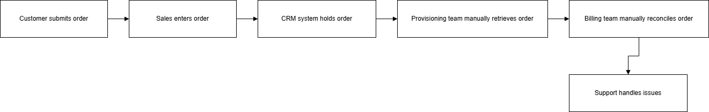
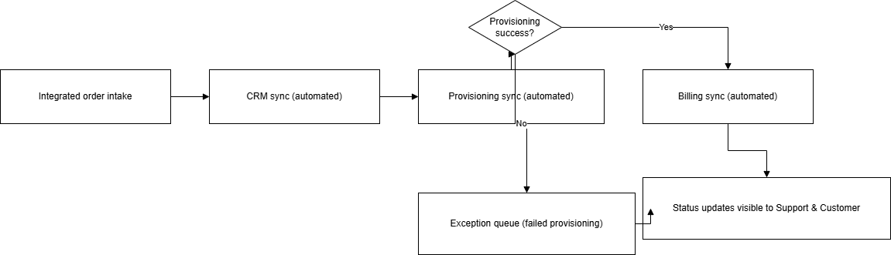
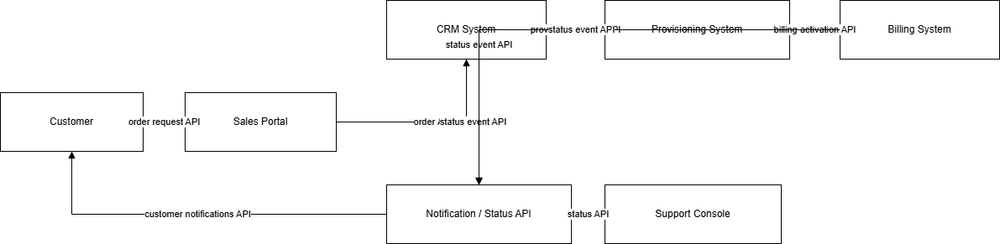
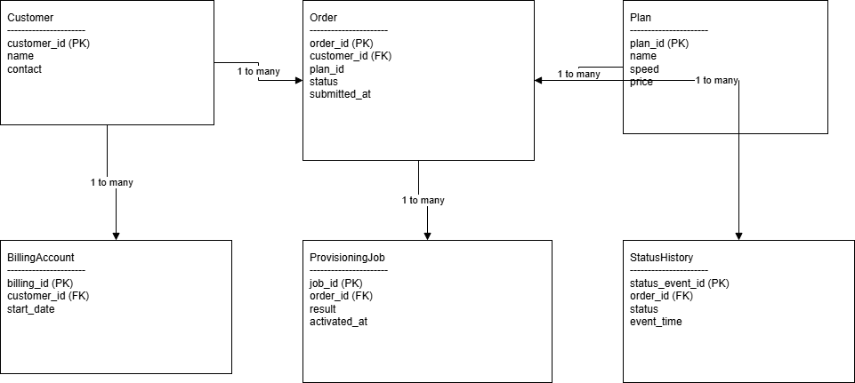

# Digital Customer Service Ordering & Provisioning System
## Business Systems Analysis Case Study

**Author:** Musa Ceesay  
**Role:** Business Systems Analyst  
**Domain:** Telecom / ISP Operations

This case study analyzes a home internet service ordering process with recurring activation delays, duplicate data entry, and limited cross-team visibility. The analysis defines process and system changes required to unify sales, provisioning, billing, and support workflows. It includes requirements, process modeling, stakeholder analysis, system context, and conceptual data modeling artifacts. The expected outcome is faster activation, fewer provisioning errors, and more consistent customer communication.

---

## 1. Executive Summary

The business problem is a fragmented order-to-activation process where sales, provisioning, and billing operate with partial data and inconsistent status updates. The system gap is the absence of a shared orchestration model and common tracking identifiers across connected systems.

The analysis approach combined stakeholder mapping, AS-IS/TO-BE process design, requirement definition, and conceptual data modeling. Based on these artifacts, the target-state design introduces shared order tracking, automation for eligible activations, and exception-driven handling for failed provisioning events.

Expected operational impact includes shorter activation cycles, lower rework from duplicate entry, reduced support effort per order, and improved visibility for both customers and internal teams.

---

## 2. Business Problem & Context

### Problem Statement

Customers ordering home internet service experience activation delays, manual re-entry of the same data across systems, and status confusion between sales, provisioning, and billing teams. The organization requires an integrated ordering and provisioning model to reduce cycle time and improve order visibility.

### Current Operational Pain Points

- Duplicate order capture across CRM, provisioning, and billing touchpoints
- Manual handoffs between functions without shared status definitions
- Delayed provisioning due to incomplete or inconsistent payloads
- Increased support contacts caused by unclear activation progress

### Cross-System Visibility Issues

- Teams do not consistently reference one shared order identity
- Customer-facing status is not synchronized with operational state changes
- Billing and support often receive updates after provisioning events have occurred

### Activation Delay Causes

- Incomplete order data at submission
- Manual correction steps before provisioning can proceed
- Reconciliation effort between systems with differing records
- Exception handling performed ad hoc rather than via a defined queue

---

## 3. Business Goals & KPIs

### Business Goals

1. Reduce order activation time from 3 days to 1 day.
2. Eliminate duplicate data entry across systems.
3. Provide real-time order status visibility.
4. Reduce provisioning errors by 40%.
5. Improve customer satisfaction score (CSAT).

### KPI Table

| KPI Metric | Baseline / Current State | Target State |
|---|---:|---:|
| Average activation time | 3 days | 1 day |
| Provisioning error rate | Current baseline tracked | 40% reduction |
| Duplicate data entry events | Present across workflow | Eliminate duplicate entry |
| Percent of orders auto-provisioned | Current baseline tracked | Increase from baseline |
| Support tickets per order | Current baseline tracked | Reduce from baseline |
| Customer satisfaction (CSAT) | Current baseline tracked | Improve from baseline |

---

## 4. Stakeholder Analysis

| Stakeholder | Role | Primary Concern | Success Measure |
|---|---|---|---|
| Sales Rep | Submits customer orders | Speed and simple order intake | Complete order submitted first pass |
| Customer | Requests internet service | Activation clarity and timeline transparency | Predictable activation and clear status updates |
| Provisioning Team | Activates line and service profile | Accurate order payload and fewer corrections | Lower rework and faster activation completion |
| Billing | Starts billing cycle | Correct plan, pricing, and start date | Fewer billing corrections post-activation |
| Support | Handles issues and escalations | End-to-end order visibility | Fewer status-related tickets and escalations |
| IT / Engineering | Maintains integrated systems | Stable integrations and observability | Reliable data exchange and auditable status changes |

---

## 5. AS-IS Process Summary


*Figure — AS-IS Ordering & Provisioning Process*

The current workflow relies on manual transitions between teams and systems. Sales captures order details, provisioning validates and configures service, and billing initiates charging. Because data is re-entered and reconciled at multiple points, defects and delays propagate downstream.

### AS-IS Characteristics

- Manual validation and handoff activities
- Multiple records representing the same order across systems
- Inconsistent status communication to customer-facing teams
- Late discovery of payload quality issues during provisioning

### AS-IS Artifact References

- Export: `assets/projects/diagrams/as-is-process-export.svg`
- Source: `assets/projects/diagrams/as-is-process.drawio`

---

## 6. TO-BE Process Design


*Figure — TO-BE Integrated Order Orchestration Flow*

The target state introduces an integrated order flow with shared tracking, eligibility-based automation, and explicit exception routing. Order data is validated earlier, status changes are surfaced consistently, and cross-team coordination follows a unified lifecycle model.

### TO-BE Design Highlights

- Shared order identity across CRM, provisioning, and billing integrations
- Automated activation path for eligible orders
- Real-time status model for internal users and customer visibility
- Exception queue for failed provisioning events requiring manual intervention

### TO-BE Artifact References

- Export: `assets/projects/diagrams/to-be-process-export.svg`
- Source: `assets/projects/diagrams/to-be-process.drawio`

---

## 7. Requirements Summary

### Functional Requirements (Top 12)

1. Validate mandatory order fields before submission.
2. Generate and persist a shared order ID used across integrated systems.
3. Integrate CRM, provisioning, and billing around that shared ID.
4. Publish real-time order status updates to internal users.
5. Surface customer-visible status updates aligned to operational events.
6. Support automated activation for eligible orders.
7. Route failed activation attempts to an exception case workflow.
8. Record status transition history for each order lifecycle event.
9. Support role-appropriate access views for sales, provisioning, billing, and support.
10. Trigger billing initiation on successful activation state.
11. Enable support teams to view end-to-end order status context.
12. Preserve manual override capability with traceability for corrections.

### Non-Functional Requirements (Top 8)

1. Meet 99.9% monthly availability target.
2. Ensure status updates are visible within 60 seconds of process events.
3. Enforce role-based access control across user groups.
4. Maintain audit logging for status changes and manual overrides.
5. Preserve integration reliability under normal operating load.
6. Maintain data consistency across CRM, provisioning, and billing records.
7. Support operational observability for troubleshooting integration failures.
8. Provide secure API-based integration for connected systems.

---

## 8. User Stories & Acceptance Criteria

### US-01: Sales Order Entry

**Story:** As a sales rep, I want one guided form so I can submit complete orders without rework.  
**Acceptance (Gherkin):**

```gherkin
Given a required field is missing
When the sales rep submits the order
Then the system blocks submission and displays missing fields
```

### US-02: Customer Order Tracking

**Story:** As a customer, I want real-time status updates so I know when service will be activated.  
**Acceptance (Gherkin):**

```gherkin
Given an order status changes in provisioning
When the lifecycle event is recorded
Then the customer-facing status updates within 60 seconds
```

### US-03: Provisioning Automation

**Story:** As provisioning staff, I want eligible orders auto-activated so manual workload decreases.  
**Acceptance (Gherkin):**

```gherkin
Given technical eligibility checks pass
When order processing begins
Then activation completes without manual intervention
```

### US-04: Billing Readiness

**Story:** As a billing analyst, I want activation-confirmed order data so billing starts correctly.  
**Acceptance (Gherkin):**

```gherkin
Given an order reaches successful activation
When billing is triggered
Then plan, pricing, and start date match the order record
```

### US-05: Support Visibility

**Story:** As a support agent, I want end-to-end status visibility so I can resolve customer inquiries faster.  
**Acceptance (Gherkin):**

```gherkin
Given a support agent searches by order ID
When the order is retrieved
Then lifecycle status, recent events, and exception state are visible
```

### US-06: Exception Handling

**Story:** As a provisioning lead, I want failed activations routed to an exception queue so corrections are tracked.  
**Acceptance (Gherkin):**

```gherkin
Given provisioning fails
When the failure event is captured
Then an exception case is created with reason code and owner
```

---

## 9. System Context & Data Model


*Figure — System Context Diagram*


*Figure — Conceptual ER Data Model*

### Integrated Systems and Boundaries

The solution context connects CRM intake, provisioning execution, billing initiation, and support visibility through shared order lifecycle data. The primary boundary is the order-to-activation process for residential internet service; downstream enterprise contract handling and logistics remain outside this model.

### System Context Artifact References

- Export: `assets/projects/diagrams/system-context-export.svg`
- Source: `assets/projects/diagrams/system-context.drawio`

### Core Entity Model (Conceptual ER)

| Entity | Key Fields | Relationships |
|---|---|---|
| Customer | customer_id, name, contact, address | 1-to-many with Order |
| Order | order_id, customer_id, plan_id, status, submitted_at | Many-to-1 Customer; 1-to-many Status History |
| Plan | plan_id, name, speed_tier, monthly_price | 1-to-many with Order |
| Provisioning Job | job_id, order_id, activation_result, activated_at | 1-to-1 or 1-to-many with Order (retries) |
| Billing Account | billing_id, customer_id, plan_id, start_date | Many-to-1 Customer; linked to activated Order |
| Status History | status_event_id, order_id, status, event_time, actor | Many-to-1 with Order |

---

## 10. Analyst Scope

### Analyst Scope

- Requirements definition
- Stakeholder mapping
- Process modeling
- System context design
- Data model design
- Risk and assumptions analysis

---

## 11. Key Analyst Decisions

### Key Analyst Decisions

- Chose shared order ID across systems to eliminate reconciliation errors
- Designed event-based status model for cross-team visibility
- Introduced exception-driven provisioning flow to reduce manual workload

---

## 12. Assumptions, Risks, Scope

### Assumptions

- Existing CRM and billing systems expose secure APIs.
- Product catalog and eligibility rules are centrally maintained.
- Support teams will adopt standardized status definitions.

### Risk Register

| Risk | Impact | Mitigation |
|---|---|---|
| Legacy integration latency | Delayed sync and stale status visibility | Introduce monitoring thresholds and retry controls |
| Incomplete historical data | Migration defects and order quality issues | Validate migration datasets and enforce quality checks |
| Operational resistance | Slower adoption of new workflow | Deliver role-based training and phased rollout support |

### Scope Boundaries

**In Scope:** Residential internet orders, activation workflow, status tracking, billing trigger integration, support exception queue.  
**Out of Scope:** Hardware warehouse logistics, field technician dispatch optimization, enterprise contracts, collections processes.

---

## 13. Expected Business Impact

The target-state model is expected to reduce average activation time by removing re-entry cycles and improving handoff quality. Provisioning error rates should decrease through earlier validation, shared identifiers, and structured exception handling.

Support load per order is expected to decline as status clarity improves for both teams and customers. Customer experience should improve through transparent activation progress and fewer delays caused by back-office reconciliation.

---

## 14. Next Steps / Implementation Roadmap

### Phase 1 — Integration

- Implement shared order ID across CRM, provisioning, and billing interfaces.
- Establish status event schema and baseline observability.
- Validate API contracts and role-based access controls.

### Phase 2 — Automation

- Enable automated activation for eligible order paths.
- Implement exception-case generation for failed provisioning events.
- Add operational dashboards for activation cycle and error monitoring.

### Phase 3 — Optimization

- Tune eligibility and routing logic using KPI trend analysis.
- Refine support workflows based on ticket-volume patterns.
- Expand continuous improvement cadence for process and data quality.

---

## Appendix: Reference Artifacts

- Case page: `projects/customer-service-ordering-provisioning-system.html`
- PDF brief: `projects/customer-service-ordering-provisioning-brief.pdf`
- AS-IS diagram: `assets/projects/diagrams/as-is-process-export.svg`
- TO-BE diagram: `assets/projects/diagrams/to-be-process-export.svg`
- System context diagram: `assets/projects/diagrams/system-context-export.svg`
- Draw.io sources: `assets/projects/diagrams/as-is-process.drawio`, `assets/projects/diagrams/to-be-process.drawio`, `assets/projects/diagrams/system-context.drawio`
